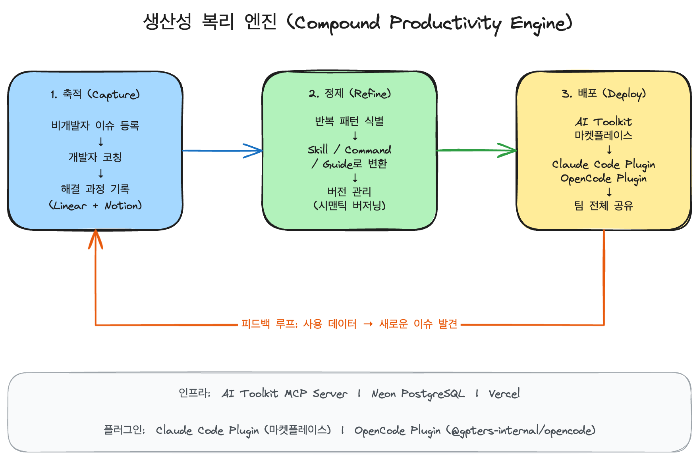
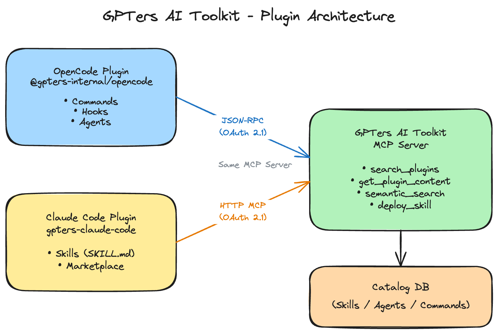

# GPTers AI Toolkit

GPTers 팀을 위한 AI 코딩 스킬, 에이전트, 커맨드, 가이드, 훅 공유 플랫폼입니다.

비개발자의 바이브 코딩 과정에서 발생하는 노하우를 체계적으로 축적하고, 반복 패턴을 Skill/Command/Guide로 정제하여 팀 전체에 공유하는 **생산성 복리 엔진**입니다.

## 생산성 복리 엔진

> 코칭 과정에서 발생하는 노하우가 휘발되지 않고, 재사용 가능한 형태로 축적되어 팀 전체의 생산성이 복리처럼 성장하는 구조



## 주요 기능

### 콘텐츠 관리

- **카탈로그** — 스킬, 에이전트, 커맨드, 훅, 가이드, 패키지를 검색, 필터링, 설치
- **패키지** — 관련 아이템을 묶어서 한 번에 설치
- **버전 관리** — 시맨틱 버저닝, 변경 이력, 롤백 지원
- **드래프트/발행** — 작성 중인 콘텐츠와 발행된 콘텐츠 분리

### MCP 통합

- **MCP 서버** — Claude Code / OpenCode에서 직접 플러그인 검색 및 사용
- **의미 기반 검색** — "코드 리뷰 도와주는 스킬 찾아줘" 같은 자연어 요청 지원
- **배포 시스템** — 대화 중 만든 스킬을 즉시 팀과 공유 (`deploy_skill`)
- **개선 제안** — 다른 사람의 스킬에 개선을 제안하고 반영

### 조직 관리

- **멀티 테넌시** — 조직별 콘텐츠 격리 및 공유 범위 제어
- **도메인 자동 가입** — 이메일 도메인 기반 조직 자동 매칭
- **RBAC** — super_admin, admin, editor, viewer 역할 기반 권한 관리
- **가시성 제어** — public / private 아이템 가시성

### 플러그인 지원

- **Claude Code Plugin** — 마켓플레이스에서 원클릭 설치
- **OpenCode Plugin** — npm 퍼블릭 패키지 (`@gpters/opencode`)
- **Codex Plugin** — npm 퍼블릭 패키지 (`@gpters/codex-plugin`)
- **MCP 직접 연결** — `claude mcp add`로 HTTP MCP 서버 연결

### 분석 및 추적

- **세션 추적** — MCP 세션별 사용 패턴 분석
- **스킬 이벤트** — 검색 → 조회 → 배포 퍼널 추적
- **감사 로그** — MCP 요청/응답 로깅 및 보안 감사
- **복리 엔진 지표** — 팀 생산성 메트릭 대시보드

## 빠른 시작

### Claude Code (권장)

```bash
claude plugin marketplace add chat-prompt/gpters-ai-toolkit 2>/dev/null; claude mcp remove gpters-ai-toolkit 2>/dev/null; claude plugin install gpters-ai-toolkit
```

### OpenCode

```bash
[ ! -f ~/.config/opencode/opencode.json ] && echo '{"$schema":"https://opencode.ai/config.json","plugin":[]}' > ~/.config/opencode/opencode.json; \
node -e "const fs=require('fs'),f=process.env.HOME+'/.config/opencode/opencode.json',c=JSON.parse(fs.readFileSync(f,'utf8'));c.plugin=c.plugin||[];c.plugin.includes('@gpters/opencode')||c.plugin.push('@gpters/opencode@latest');fs.writeFileSync(f,JSON.stringify(c,null,2))"
```

### MCP 직접 연결

```bash
claude mcp add gpters-ai-toolkit https://ai-toolkit.gpters.org/api/mcp -t http
```

브라우저에서 Google (@gpters.org) 로그인 후 자동 연결됩니다.

> 설치 가이드: https://ai-toolkit.gpters.org/getting-started

### 사용하기

Claude Code / OpenCode에서 자연어로 요청:

```
"코드 리뷰 스킬 찾아줘"
"DB 마이그레이션 도와주는 스킬 있어?"
"이 스킬 팀이랑 공유해줘"
```

## 아키텍처



## 프로젝트 구조

Turbo 모노레포 구조로 운영됩니다.

```
gpters-ai-toolkit/
├── apps/
│   ├── web/                         # Next.js 웹 애플리케이션
│   │   ├── app/                     # App Router 페이지 및 API
│   │   │   ├── api/                 # API 라우트
│   │   │   ├── skill/[id]/          # 스킬 상세 페이지
│   │   │   ├── agent/[id]/          # 에이전트 상세 페이지
│   │   │   ├── command/[id]/        # 커맨드 상세 페이지
│   │   │   ├── hook/[id]/           # 훅 상세 페이지
│   │   │   ├── package/[id]/        # 패키지 상세 페이지
│   │   │   ├── guides/              # 가이드 목록 및 상세
│   │   │   ├── getting-started/     # 설치 가이드
│   │   │   ├── admin/               # 관리자 대시보드
│   │   │   ├── profile/             # 사용자 프로필
│   │   │   ├── stats/               # 통계 대시보드
│   │   │   ├── privacy/             # 프라이버시 정책
│   │   │   ├── oauth/               # OAuth 인증 플로우
│   │   │   └── templates/           # 프로젝트 템플릿
│   │   ├── components/              # React 컴포넌트 (58개)
│   │   ├── lib/                     # 비즈니스 로직
│   │   └── tests/                   # 테스트 (Vitest, Playwright)
│   │
│   ├── claude-code-plugin/          # Claude Code 마켓플레이스 플러그인
│   ├── opencode-plugin/             # OpenCode 플러그인 (npm)
│   └── codex-plugin/                # Codex 플러그인 (npm)
│
├── packages/
│   ├── db/                          # Drizzle ORM 스키마 및 마이그레이션
│   ├── lib/                         # 공유 라이브러리 (MCP, auth, types)
│   └── tsconfig/                    # 공유 TypeScript 설정
│
└── docs/                            # 문서 및 다이어그램
```

## 기술 스택

| 분류 | 기술 |
|------|------|
| **Framework** | Next.js 16, React 19, TypeScript |
| **Styling** | Tailwind CSS v4 |
| **Database** | Neon PostgreSQL + Drizzle ORM |
| **Auth** | NextAuth v5 + Google OAuth (@gpters.org 도메인 제한) |
| **MCP Auth** | OAuth 2.1 (PKCE) |
| **Testing** | Vitest (unit/API), Playwright (E2E) |
| **Monorepo** | Turbo |
| **Deployment** | Vercel (웹), npm/Verdaccio (플러그인) |

## 데이터 모델

### 아이템 타입

| 타입 | 설명 | 주요 필드 |
|------|------|-----------|
| `skill` | Claude Code 스킬 | `allowedTools`, `content` |
| `agent` | AI 에이전트 | `agentModel`, `agentPermissionMode`, `agentSkills` |
| `command` | 슬래시 커맨드 | `commandArgumentHint`, `commandDisableModelInvocation` |
| `hook` | 훅 설정 | `hookEvent`, `hookMatcher`, `hookCommand`, `hookBlocking` |
| `guide` | 가이드 문서 | `content`, `readme` |
| `package` | 아이템 묶음 | `packageItems` (M:N 관계) |

### 데이터베이스 테이블

| 그룹 | 테이블 | 설명 |
|------|--------|------|
| **콘텐츠** | `catalogItems` | 메인 카탈로그 (벡터 임베딩 포함) |
| | `catalogItemTags` | 아이템-태그 M:N |
| | `packageItems` | 패키지-아이템 M:N |
| | `itemVersions` | 버전 히스토리 및 스냅샷 |
| | `tags` | 태그 마스터 |
| **사용자** | `users` | OAuth 사용자 |
| | `organizations` | 조직 |
| | `orgMemberships` | 조직 멤버십 |
| | `orgInvitations` | 조직 초대 |
| **OAuth 2.1** | `oauthClients` | MCP 클라이언트 등록 |
| | `oauthCodes` | 인가 코드 (PKCE) |
| | `oauthAccessTokens` | 액세스 토큰 |
| | `oauthRefreshTokens` | 리프레시 토큰 |
| **분석** | `mcpAuditLogs` | MCP 요청 감사 로그 |
| | `mcpSessions` | 세션 추적 |
| | `skillEvents` | 스킬 사용 이벤트 |
| **협업** | `suggestions` | 개선 제안 |
| | `mcpServers` | MCP 서버 레지스트리 |

## API 엔드포인트

### 카탈로그

| 메소드 | 엔드포인트 | 설명 |
|--------|-----------|------|
| `GET` | `/api/catalog` | 아이템 목록 (필터링, 검색) |
| `POST` | `/api/catalog` | 새 아이템 생성 |
| `GET` | `/api/catalog/[id]` | 아이템 상세 조회 |
| `GET` | `/api/catalog/[id]/dependencies` | 아이템 의존성 조회 |

### 조직

| 메소드 | 엔드포인트 | 설명 |
|--------|-----------|------|
| `GET/POST` | `/api/organizations` | 조직 목록/생성 |
| `GET/PATCH/DELETE` | `/api/organizations/[orgId]` | 조직 상세/수정/삭제 |
| `GET/POST` | `/api/organizations/[orgId]/members` | 멤버 관리 |
| `GET/POST/DELETE` | `/api/organizations/[orgId]/domains` | 도메인 자동 가입 관리 |

### 버전 관리

| 메소드 | 엔드포인트 | 설명 |
|--------|-----------|------|
| `GET` | `/api/versions/[itemId]` | 버전 히스토리 조회 |
| `POST` | `/api/versions/[itemId]/rollback` | 특정 버전으로 롤백 |

### 관리자

| 메소드 | 엔드포인트 | 설명 |
|--------|-----------|------|
| `GET` | `/api/admin/stats` | 통계 대시보드 |
| `GET` | `/api/admin/users` | 사용자 관리 |

| `GET` | `/api/admin/security-audit` | 보안 감사 |


### 기타

| 메소드 | 엔드포인트 | 설명 |
|--------|-----------|------|
| `POST` | `/api/mcp` | MCP JSON-RPC 2.0 엔드포인트 |
| `GET/POST` | `/api/mcp-servers` | MCP 서버 레지스트리 |
| `GET/POST` | `/api/tags` | 태그 관리 |
| `GET` | `/api/stats` | 공개 통계 |
| `GET` | `/api/user` | 현재 사용자 정보 |
| `GET` | `/api/updates/check` | 버전 업데이트 확인 |
| `GET` | `/api/welfare-engine/stats` | 복리 엔진 지표 |
| `GET` | `/api/discovery-analysis` | 검색 분석 |
| `POST` | `/api/cron/finalize-sessions` | 세션 정리 (Cron) |

## MCP 도구

| 도구 | 설명 |
|------|------|
| `semantic_search` | 의미 기반 플러그인 검색 |
| `get_plugin_content` | 플러그인 전체 내용 조회 |
| `deploy_skill` | 스킬/에이전트/커맨드 배포 |
| `undeploy_skill` | 배포된 스킬 제거 |
| `check_updates` | 설치된 스킬 업데이트 확인 |
| `suggest_improvement` | 다른 플러그인에 개선 제안 |
| `list_suggestions` | 제안 목록 조회 |
| `resolve_suggestion` | 제안 수락/거절 |
| `add_files` | 스킬에 파일 추가 |
| `remove_files` | 스킬에서 파일 제거 |
| `report_session_event` | 세션 이벤트 보고 |
| `report_search_skip` | 검색 스킵 보고 |
| `report_skill_outcome` | 스킬 사용 결과 보고 |

## 개발 환경 설정

```bash
# 의존성 설치
pnpm install

# 환경 변수 설정
cp .env.example .env.local
# .env.local 편집

# 개발 서버 실행
pnpm dev

# 테스트
pnpm test          # 유닛 + API 테스트
pnpm test:e2e      # E2E 테스트
pnpm lint          # ESLint
```

### 환경 변수

| 변수 | 설명 | 필수 |
|------|------|------|
| `DATABASE_URL` | Neon PostgreSQL 연결 문자열 | O |
| `GOOGLE_CLIENT_ID` | Google OAuth 클라이언트 ID | O |
| `GOOGLE_CLIENT_SECRET` | Google OAuth 시크릿 | O |
| `NEXTAUTH_SECRET` | NextAuth 시크릿 | O |
| `GH_TOKEN` | GitHub API 토큰 (플러그인 동기화) | |
| `DEV_BYPASS_AUTH` | 개발 환경 인증 우회 (`true`로 설정) | |

## 스크립트

```bash
# 개발
pnpm dev            # 개발 서버 (포트 3000)
pnpm build          # 프로덕션 빌드
pnpm start          # 프로덕션 서버

# 품질
pnpm lint           # ESLint
pnpm test           # 유닛 + API 테스트
pnpm test:watch     # 테스트 워치 모드
pnpm test:api       # API 테스트만
pnpm test:e2e       # E2E 테스트
pnpm test:e2e:ui    # E2E UI 모드
pnpm test:all       # 전체 테스트

# 데이터베이스
pnpm db:generate    # 마이그레이션 생성
pnpm db:push        # 스키마 푸시
pnpm db:studio      # Drizzle Studio
```

## 보안

- **인증**: NextAuth v5 + Google OAuth (@gpters.org 도메인만)
- **MCP 인증**: OAuth 2.1 with PKCE (브라우저 로그인)
- **권한**: RBAC (super_admin, admin, editor, viewer)
- **가시성**: 아이템별 public/private 제어
- **감사**: MCP 요청 감사 로그 및 보안 감사 대시보드

## 플러그인 배포 구조

| 플러그인 | 배포 방식 |
|----------|-----------|
| claude-code-plugin | Git push → 마켓플레이스 자동 반영 (새 세션부터) |
| opencode-plugin | `npm publish` → npm public (`@gpters/opencode`) |
| codex-plugin | `npm publish` → npm public (`@gpters/codex-plugin`) |
| 웹 (Next.js) | Git push → Vercel 자동 배포 |

## 관련 링크

| 링크 | 설명 |
|------|------|
| [AI Toolkit](https://ai-toolkit.gpters.org) | 마켓플레이스 (스킬 배포/검색) |
| [설치 가이드](https://ai-toolkit.gpters.org/getting-started) | Claude Code / OpenCode / MCP 설치 |
| [Linear 프로젝트](https://linear.app/geniefy/project/생산성-복리-엔진-프로젝트-541a0544201b) | 복리 엔진 프로젝트 관리 |

## 기여하기

1. 새 스킬/에이전트 만들기
2. Claude Code에서 `"이 스킬 팀이랑 공유해줘"`로 배포
3. 또는 웹 관리자 대시보드(`/admin`)에서 직접 추가
4. 다른 사람의 스킬에 `suggest_improvement`로 개선 제안

## 라이선스

MIT License - see [LICENSE](LICENSE) for details.
