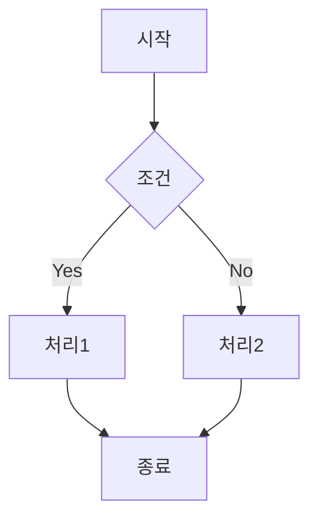

# Code Explainer

복잡한 코드, 알고리즘, 아키텍처를 분석하여 이해하기 쉬운 설명을 제공합니다.

## Usage

설명이 필요한 코드 파일이나 스니펫과 함께 실행하세요.

```
/explain-code src/utils/cryptoHelper.ts
/explain-code --level beginner
```

## Explanation Levels

### Beginner (초급)
- 기본 개념부터 설명
- 전문 용어 최소화
- 비유와 예시 활용

### Intermediate (중급)
- 기술적 세부사항 포함
- 디자인 패턴 언급
- 성능 고려사항 설명

### Advanced (고급)
- 내부 동작 원리
- 최적화 기법
- 대안적 접근 방식

## Output Format

```markdown
## Code Explanation: [파일명/함수명]

### Overview
[한 문장 요약]

### What It Does
[목적과 기능 설명]

### How It Works
[단계별 동작 설명]

1. **Step 1**: [설명]
2. **Step 2**: [설명]
...

### Key Concepts
- **[개념1]**: [설명]
- **[개념2]**: [설명]

### Flow Diagram


### Usage Example
```typescript
// 이렇게 사용합니다
const result = await processData(input)
```

### Common Pitfalls
- [주의사항1]
- [주의사항2]

### Related Concepts
- [관련 개념 링크]
```

## Features

- **다이어그램 생성**: Mermaid 플로우차트/시퀀스 다이어그램
- **라인별 주석**: 각 라인이 하는 일 설명
- **비유 사용**: 복잡한 개념을 실생활에 비유
- **예제 코드**: 사용법을 보여주는 예제

## Example

```
/explain-code
```typescript
const debounce = (fn, delay) => {
  let timeoutId;
  return (...args) => {
    clearTimeout(timeoutId);
    timeoutId = setTimeout(() => fn(...args), delay);
  };
};
```
```

Output:
> **Debounce 함수**는 마치 엘리베이터 문과 같습니다.
> 누군가 버튼을 누르면 문이 바로 닫히지 않고,
> 일정 시간 기다렸다가 아무도 타지 않으면 그때 닫힙니다.
> 연속된 호출 중 마지막 호출만 실행됩니다.
